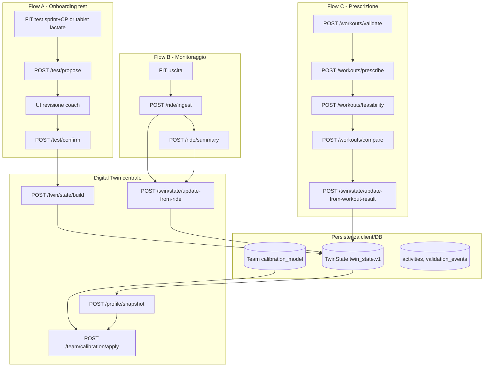

# Frontend Developer Guide — Digital Twin Backend V5.2.3

Unified document for a **software developer** who needs to build the frontend connected to this backend, **with no background in endurance cycling**. It explains what the backend (v **5.2.3**) produces, how to interpret the metrics, how to draw them, how to design the main pages, and how to use **TwinState** as the central persistence model.

**Related documents (read in this order)**

| Priority | Document | Content |
|----------|-----------|-----------|
| 1 | This file | Overview, API, TwinState, page map |
| 2 | `docs/FRONTEND_IMPLEMENTATION_BLUEPRINT.md` | Detailed layout per page, design system, DoD |
| 3 | `docs/API_PAYLOAD_EXAMPLES.md` | curl / TypeScript examples for each endpoint |
| 3b | `docs/OPENAPI_FRONTEND.md` | OpenAPI, TS codegen, `api.*` client |
| 3c | `openapi/openapi.json` | HTTP contract committed (**132 endpoints**) |
| 3d | `docs/API_ENDPOINT_INDEX.md` | Full endpoint inventory by tag |
| 4 | `docs/WORKOUT_SYSTEM_BACKEND_V1.md` | Prescription flow → compliance |
| 5 | `docs/BACKEND_IMPLEMENTATIONS_V2.md` | TwinState, projection, neuromuscular |
| 6 | `docs/COACH_UX_COPYBOOK.md` | Copy coach facing |
| 6b | `docs/COACH_DECISION_ENGINE.md` | 20 coach endpoints, TwinState keys |
| 6c | `docs/STRENGTH_AND_FUELING_CONTRACT.md` | Strength + fueling (CHO/FAT g) |
| 7 | `docs/HARDENING_TESTS.md` | Robustness/stress suite |
| 7b | `docs/CONTRACT_FIRST_TESTING.md` | Product-contract test methodology |
| 8 | `CONTRACT_JSON_test.md` | In-person tablet test contract |

**Code references**

| Resource | Path |
|---------|------|
| HTTP API | `api_app.py` |
| Facade Python | `engines/__init__.py` |
| Canonical TwinState | `engines/twin_state/` |
| Report by activity | `engines/io/workout_summary.py` |
| Graphics config | `engines/io/chart_builder.py`, `engines/io/activity_charts.py` |
| Tier / confidence | `engines/core/tiers.py`, `engines/core/metric_contracts.py` |
| Input security | `engines/core/security.py` |
| Existing MVP frontend | `frontend/` (today reads CSV; must be migrated to the API) |

---

## 1. Product idea in one sentence

The backend transforms **FIT files** (outputs from the cycle computer), **in-person tests** (sprint, CP 3/6/12 min, lactate), **prescribed workouts** and **athlete physical data** into a **personalized physiological profile**, into **analysis for each workout** and into a **digital twin** (`TwinState`) that the frontend persists and updates over time.

It's not a "consumer platform clone" - many numbers are **modeled estimates**, not direct measurements. The backend is **honest** when data is missing or confidence is low (`status: skipped`, `null` fields, `warnings`, `tier`).

---

## 2. Minimum glossary (for those who don't cycle)

| Term | What does it mean | Typical unit |
|---------|----------------|--------------|
| **Power (W)** | How "hard" the cyclist pedals | Watt |
| **FTP** | Sustainable power ~1 h (functional threshold) | W |
| **MLSS / CP** | Power at lactate threshold (max sustainable for a long time) | W |
| **VO₂max** | Maximum aerobic capacity | ml/kg/min |
| **VLamax** | Glycolytic anaerobic capacity | mmol/L/s |
| **MMP** | Best average power for each duration (power-duration curve) | `{seconds: W}` |
| **NP** | Normalized Power — “equivalent” intensity on variable terrain | W |
| **IF** | Intensity Factor = NP / FTP | 0–1+ |
| **TSS** | Training Stress Score — output load | points |
| **CTL / ATL / TSB** | Chronic / acute / form load (detraining engine) | points |
| **Durability** | Ability to maintain performance over time (fatigue) | % or CP curve |
| **W′** | Anaerobic "Battery" above CP | Joule |
| **DFA-α₁** | HRV index linked to aerobic/anaerobic zone | 0–1 |
| **Phenotype** | Rider profile (diesel / all-rounder / sprinter) | label |
| **TwinState** | Unique JSON blob (`twin_state.v1`) with profile, load, calendar, compliance | JSON |

**Golden Rule for UI:** Always distinguish **direct measurement** (power, HR from FIT) from **model** (VO₂max from MMP, MLSS from Mader).

---

## 3. Data philosophy: tiers and confidence

Every important output leads (or can lead):

```json
{
  "status": "success | error | skipped | insufficient_data | unavailable",
  "tier": "REFERENCE | MODEL | HEURISTIC | EXPERIMENTAL",
  "api_contract": { "module": "...", "method": "...", "confidence": 0.72 },
  "uncertainty": { "confidence_score": 0.72, "confidence_level": "moderate" },
  "limitations": ["testo libero..."]
}
```

| Tiers | UI meaning | How to show it |
|------|----------------|----------------|
| **REFERENCE** | Standard formula on FIT data (NP, TSS, zones) | Full number, green "Measured/Standard" badge |
| **MODEL** | Physiological model (Mader, W′, mader_durability) | Number + blue "Model" badge + limitations tooltip |
| **HEURISTIC** | Indicative thresholds (ACWR, empirical durability) | Number + amber "Indicative" badge |
| **EXPERIMENTAL** | Exploratory | Hidden or "Labs" section |

**If `status !== "success"` or a field is `null`:** do not invent a value. Show message from backend (`reason`, `message`, `warnings`).

---

## 4. Frontend ↔ backend architecture (V5.2)

The backend is **stateless**: the frontend (or Supabase) persists **TwinState**, anchor, curve, calibration model and sends them back to the API.



**Principle V5.2:** Use `TwinState` as the **canonical read model** for the Digital Twin page, Command Center, and seasonal projections. The API now exposes **132 paths** — use `docs/API_ENDPOINT_INDEX.md` for the full map; core coach flows remain in §6–7 below.

---

## 5. TwinState v1 — core persistence model

Schema: `twin_state.v1` (`engines/twin_state/models.py`).

### 5.1 Top-level sections

| Section | Content | Updated by |
|---------|-----------|---------------|
| `athlete_profile` | Weight, sex, disciplines, training_years | `/test/confirm`, manual edit |
| `measured_anchor` | VO₂max, MLSS, VLamax measured | `/test/confirm`, `/test/in-person` |
| `metabolic_snapshot` | Full profiler snapshot | `/profile/snapshot`, `/ride/update-profile` |
| `rolling_power_curve` | Aggregate MMP curve | `/ride/ingest` |
| `load_state` | CTL/ATL/TSB, ACWR | ingest + `/load/manual` |
| `readiness_state` | Adaptive readiness | adaptive_load engines |
| `sensor_quality` | Completeness of FIT sensors | `/ride/summary` |
| `workout_calendar_state` | Calendar assignments | Frontend DB + `/workouts/calendar/transition` |
| `last_compliance_results` | Latest workout vs performed comparisons | `/workouts/compare` |
| `team_calibration_state` | Audit corrections team | `/team/calibration/apply` |
| `state_confidence` | Score 0–1 overall | calculated in build/update |
| `warnings` | List of active warnings | all flows |
| `event_log` | Event history (append-only) | update endpoints |

### 5.2 TwinState Endpoints

| Method | Path | When to call him |
|--------|------|------------------|
| POST | `/twin/state/build` | After first anchor + snapshot: create initial blob |
| POST | `/twin/state/update-from-ride` | After each ingest/summary: update curve, load, sensor quality |
| POST | `/twin/state/update-from-workout-result` | After `/workouts/compare`: append compliance |
| POST | `/twin/state/project` | Seasonal what-if from planned calendar |
| POST | `/projection/season` | Alias ​​of `/twin/state/project` |

**Recommended React flow:**

1. Load `twin_state` from DB.
2. If absent: `build` with anchor + snapshot + curves.
3. After each FIT: `ingest` → `ride/summary` → `update-from-ride` → save TwinState.
4. Before showing calibrated KPIs: `team/calibration/apply` on the snapshot inside TwinState.
5. For Seasonal Coach Planner: `projection/season` with calendar plan.

---

## 6. Full HTTP API (`api_app.py`)

Base URL example: `http://localhost:8000` (`make run` or `uvicorn api_app:app`).

### 6.1 Health and profile

| Method | Path | Scope |
|--------|------|--------|
| GET | `/health` | Health check |
| POST | `/test/propose` | N FIT file → profile proposal (not committed) |
| POST | `/test/confirm` | Proposal confirmed → anchor measured |
| POST | `/test/in-person` | Envelope tablet → test_protocols / lactate |
| POST | `/profile/snapshot` | MMP → complete metabolic snapshot |
| POST | `/ride/update-profile` | MMP exit + anchor → profile updated |

### 6.2 Activities and analysis

| Method | Path | Scope |
|--------|------|--------|
| POST | `/ride/parse` | 1 FIT → full extraction contract (streams, quality, laps, provenance) |
| POST | `/ride/ingest` | 1 FIT → update power curve (passes HR/cadence/quality to MMP) |
| POST | `/ride/summary` | FIT or `power_json` (+ optional `hr_json`) → `workout_summary` |
| POST | `/ride/intelligence` | Extended stats, zones, decoupling, chart series |
| POST | `/ride/data-quality` | Sensor coverage, gaps, quality flags |
| POST | `/ride/durability` | FIT + snapshot → residual CP + sustainable powers |
| POST | `/performance/neuromuscular-profile` | Sprint profile from FIT |
| POST | `/power-source/normalize` | Offset trainer vs power meter |
| POST | `/load/manual` | Non-cycling load (RPE × duration) |

### 6.3 Workout system

| Method | Path | Scope |
|--------|------|--------|
| POST | `/workouts/validate` | Valid workout template |
| POST | `/workouts/prescribe` | Materialize target % in watts |
| POST | `/workouts/feasibility` | Preview feasibility W′ |
| POST | `/workouts/compare` | Comparison assigned vs FIT performed |
| POST | `/workouts/calendar/transition` | FSM calendar assignment status |

### 6.4 TwinState and projection

| Method | Path | Scope |
|--------|------|--------|
| POST | `/twin/state/build` | Create TwinState v1 |
| POST | `/twin/state/update-from-ride` | Update after release |
| POST | `/twin/state/update-from-workout-result` | Append compliance |
| POST | `/twin/state/project` | Seasonal what-if projection |
| POST | `/projection/season` | Alias ​​projection |

### 6.5 Team learning

| Method | Path | Scope |
|--------|------|--------|
| POST | `/team/calibration/update` | Adds validated events to the team model |
| POST | `/team/calibration/apply` | Apply fix to snapshot or single parameter |

### 6.6 Extended engine API (V5.2 — 132 paths total)

See `docs/API_ENDPOINT_INDEX.md` for every path. Summary by tag:

| Tag | Paths | Coach / UI use |
|-----|------:|----------------|
| **coach** | **20** | Daily brief, session decision, fueling, safety, periodization — `docs/COACH_DECISION_ENGINE.md` |
| profile | 19 | Kalman, bayesian snapshot, glycolytic profile, metabolic curves, fatmax, **power VLamax proxy**, MMP quality |
| ride | 32 | Summary, ingest, analytics (W′, durability, cardiac, HRV, **dual zones**) |
| lab | 7 | Lactate steps, vLaPeak observed vs model, lab text parse |
| load | 5 | Manual load, ACWR, monotony/strain, adaptive trend |
| explainability | 8 | Confidence badges + narratives (incl. fatmax) |
| race | 2 | GPX course analyze + race simulation |
| integrations | 2 | External activity normalize / dedupe |
| meta | 2 | Engine tiers, chart config |
| twin | 6 | Build, validate, ride/workout updates, projection |

### 6.6.1 Coach fueling UI (V5.2.3)

`POST /coach/nutrition/performance-targets` returns availability targets **and** absolute session grams:

```json
"estimated_demands": {
  "session_carbohydrate_g": 142.0,
  "session_fat_g": 38.0,
  "estimated_recovery_hours": 18.5,
  "recovery_estimation_method": "empirical_formula"
}
```

- Send `power_series` (1 Hz) to populate grams and recovery.
- Show **CHO + FAT** together (INSCYD-style parity).
- Label recovery hours as **estimated** when `recovery_estimation_method` is `empirical_formula`.
- `not_a_diet: true` — never render as meal plan.

### 6.7 Zones — metabolic vs Coggan (V5.2.1)

Activity endpoints return **both** power zone systems in `sections.zones`:

| Key | Model | Anchor | When to show |
|-----|-------|--------|--------------|
| `metabolic_power` | MLSS 5-zone | Snapshot MLSS + MAP | Primary for physiology-first coaching |
| `coggan_power` | Coggan 7-zone | FTP | Comparison / athletes used to %FTP |
| `friel_hr` | Friel HR | LTHR | No power meter |
| `seiler_polarization` | 3-zone | VT1/VT2 (default from MLSS) | Polarization classification |

UI pattern: toggle or side-by-side bars; read `systems_available` and `coach_note`. Profile snapshot `zones` are **definitions only**; ride summary adds **time-in-zone** for the session.

Payload details: `docs/API_PAYLOAD_EXAMPLES.md`.

### 6.8 Power-derived VLamax (V5.2.3)

Three distinct VLamax-related values — never conflate them in the UI:

| Field | Source | Badge |
|-------|--------|-------|
| `estimated_vlamax_mmol_L_s` | Mader/MMP model (snapshot) | Model estimate |
| `power_derived_vlamax` | Sprint power trace proxy | Power proxy |
| `observed_vlapeak_mmol_l_s` | Lactate pre/post on sprint | Lab observed |

**Standalone:** `POST /profile/vlamax-from-power-series` — pass `power` (≥8 Hz samples), `dt_s`, optional `cp_w`, `vo2max_power_w`, lactate fields.

**Integrated:** `POST /profile/glycolytic-profile` — add optional `sprint_power`, `sprint_dt_s`, lactate fields; response includes `power_derived_vlamax` and `vlamax_derivation.agreement` when sprint data is supplied.

Client: `api.profileVlamaxFromPowerSeries()`, `api.profileGlycolyticProfile()`.

---

## 7. Endpoint map → frontend screens

Operational table derived from `FRONTEND_IMPLEMENTATION_BLUEPRINT.md`. Each line indicates **which endpoint feeds which page/section**.

| Page | UI section | Primary endpoints | Data to persist |
|--------|------------|------------------|-------------------|
| **Team Command Center** | Header team calibration | — (DB law) | `teams.calibration_model` |
| | KPI athletes green/yellow/red | — (derived from TwinState) | `athletes.twin_state` |
| | Athletes table | `/team/calibration/apply` on snapshot | anchor, snapshot, confidence |
| | MAE MLSS team | `/team/calibration/update` (history) | `validation_events` |
| | Accuracy graph | `validation_events` aggregation | pre/post test events |
| **Athlete Digital Twin** | Header + confidence | TwinState | `twin_state` |
| | Physiological KPIs (6 cards) | `/profile/snapshot` or snapshot in TwinState | `metabolic_snapshot` |
| | Metabolic map / combustion | snapshot.`combustion_curve` | snapshot |
| | Power duration curve | `rolling_power_curve` in TwinState | JSON curves |
| | Expressiveness checklist | snapshot.`expressiveness` | snapshot |
| | Traffic light cross-validation | snapshot.`cross_validation` | snapshot |
| | Learning audits | `/team/calibration/apply` | `team_calibration_state` |
| | Predictive durability | `/ride/durability` (last long ride) | `activities.durability` |
| | Season projection | `/projection/season` | calendar plan |
| **Activity Analysis** | Summary cards (NP, IF, TSS) | `/ride/summary` | `activities.summary` |
| | Multi-series timeline | `activity_charts` configs from summary | stream metadata |
| | Zone distribution | summary.`sections.zones` (`metabolic_power` + `coggan_power`) | summary |
| | Cardiac response | summary.`sections.cardiac` | summary |
| | HRV timeline | summary.`sections.hrv` | summary (ramp test only) |
| | Mader durability | `/ride/durability` or summary.`mader_durability` | JSON durability |
| | Neuromuscular (sprint) | `/performance/neuromuscular-profile` | optional |
| **Testing Lab** | Upload FIT → proposal | `/test/propose` | temporary proposal |
| | Confirm coach | `/test/confirm` | `measured_anchor` |
| | Tablet/lactate test | `/test/in-person` | envelope + result |
| | Pre-test prediction (mandatory) | `/profile/snapshot` **before** testing | `validation_events.predicted_value` |
| | Post-test learning | `/team/calibration/update` | `calibration_model` |
| **Model Accuracy** | MAE/bias KPI by parameter | `validation_events` aggregation | events |
| | Scatter predicted vs measured | `validation_events` | events |
| | Event table | DB | events |
| | Update model | `/team/calibration/update` | `calibration_model` |
| **Coach Planner** | Workout editor | `/workouts/validate` | template library |
| | Watt prescription | `/workouts/prescribe` | prescription |
| | Preview feasibility | `/workouts/feasibility` | feasibility report |
| | Calendar assignment | `/workouts/calendar/transition` | assignment status |
| | Target zones | snapshot.`zones` | snapshot |
| | Training focus cards | frontend rules on VLamax/durability | snapshot + readiness |
| | Season what-if | `/projection/season` | calendar plan |
| **Data Quality Center** | Sensor checklist | TwinState.`sensor_quality` | twin_state |
| | MMP completeness | TwinState.`rolling_power_curve` | twin_state |
| | Anchor freshness | TwinState.`measured_anchor` | twin_state |
| | Power source warning | `/power-source/normalize` | offset report |
| | Non-cycling load | `/load/manual` | manual sessions |

### 6.6 Navigation rules between pages

| User event | API Sequence |
|---------------|--------------|
| New athlete + FIT test | propose → confirm → snapshot → twin/build |
| Upload output | ingest → summary → twin/update-from-ride → (if refresh) update-profile |
| Test validated with learning | snapshot (pre-test) → in-person/confirm → validation_event → calibration/update |
| Assign workouts | validate → prescribe → feasibility → (save DB) → compare → twin/update-from-workout |
| Open Digital Twin | load twin_state → calibration/apply → render |

---

## 8. Operational flows

### 8.1 Flow A — Profile creation (FIT test)

1. Coach loads 1+ FIT (sprint + CP3/6/12 ideally).
2. `POST /test/propose` (multipart `files[]`) → `ProfileProposal`.
3. **review** UI: chosen sprint, CP blocks, confidence, source file.
4. Coach confirm → `POST /test/confirm`:

```json
{
  "proposal": { "...ProfileProposal.to_dict()..." },
  "athlete": { "weight_kg": 72, "gender": "MALE", "training_years": 10, "discipline": "ENDURANCE" },
  "measured_on": "2026-06-01"
}
```

5. `POST /profile/snapshot` with MMP derived.
6. `POST /twin/state/build` → save `twin_state` to DB.

### 8.2 Flow B — Output monitoring

1. `POST /ride/data-quality` — show sensor coverage and warnings to coach.
2. `POST /ride/parse` — persist full parse report (`activity_parse_reports` table).
3. `POST /ride/intelligence` or `/ride/summary` for coach-facing analysis.
4. `POST /ride/ingest` — form: `file`, `ride_date`, `weight_kg`, `stored_curve_json` (optional).
5. `POST /twin/state/update-from-ride` with `ingest_result` + `ride_summary`.
6. If `profile_should_refresh`: `POST /ride/update-profile` → update snapshot in TwinState.

**Data provenance UI (mandatory):** every coach card shows one of:
`Misurato FIT` | `Calcolo standard` | `Modello fisiologico` | `Euristico` | `Non disponibile`,
plus `confidence_score`, `tier`, `warnings` when present. Never show model VO₂max as a direct measurement.

**JSON-only uploads:** pass `hr_json` explicitly; the backend never synthesizes HR from `power_json`.

### 8.3 Flow C — Workout prescription

See `docs/WORKOUT_SYSTEM_BACKEND_V1.md`:

```
validate → prescribe → feasibility → (assign in DB) → compare → twin/update-from-workout-result
```

### 8.4 Flow D — Team learning

1. **Before** testing: Save `predicted_value` from current snapshot.
2. After validated test: Create `ValidationEvent` with `measured_value`.
3. `POST /team/calibration/update` with event.
4. On Digital Twin: `POST /team/calibration/apply` before showing KPI.

---

## 9. Metabolic snapshot — heart of the Digital Twin

Main fields to show on the profile page:

| Field | Description | UI |
|-------|-------------|-----|
| `estimated_vo2max` | Estimated VO₂max | Large KPI + units ml/kg/min |
| `estimated_vlamax_mmol_L_s` | VLamax | KPI + phenotype scale |
| `mlss_power_watts` / `mlss_power_wkg` | Lactate threshold | KPIs W and W/kg |
| `fatmax_power_watts` | Maximum fat oxidation | KPIs |
| `map_aerobic_watts` | Aerobic MAP | Secondary KPI |
| `metabolic_phenotype` | Diesel / sprinter / … | Badge + icon |
| `confidence_score` | Global reliability | Gauge 0–100% |
| `combustion_curve` | Fat vs carbs vs power | Area chart stacked |
| `zones` | Profile zones | Bars or table |
| `cross_validation` | Model consistency vs observed power | Traffic light + text |
| `unmasked_estimates` | "Debug" values ​​if masked field | Technical modal only |
| `expressiveness` | What MMP durations are missing | Anchor checklist |

**Masking:** If MMP does not cover threshold durations, `mlss_power_watts` can be `null` but `unmasked_estimates` has the raw value. The UI should **not** show the masked value as certain.

**Cross-validation (`cross_validation`):**

| `severity` | UI |
|------------|-----|
| `none` | Green — consistent profile |
| `mild` / `moderate` | Yellow — warning + `recommended_action` |
| `severe` | Red — "Unreliable, repeat test" |

---

## 10. Single activity report — `build_workout_summary`

Endpoint: `POST /ride/summary` (multipart: `file` **or** `power_json`, `weight_kg`, opt. `ftp`, `metabolic_snapshot_json`).

### 10.1 Response structure

```json
{
  "status": "success",
  "schema_version": "1.0.0",
  "stream_metadata": { "duration_s", "has_power", "has_hr", "has_rr", ... },
  "sections": {
    "power": { ... },
    "zones": { ... },
    "classification": { ... },
    "hrv": { ... },
    "cardiac": { ... },
    "mader_durability": { ... }
  },
  "headline": { ... },
  "warnings": [ "..." ],
  "section_contracts": { ... }
}
```

### 10.2 Recommended sections and graphs

| Section | Content | Visualization |
|---------|-----------|-----------------|
| **power** | NP, IF, TSS, VI, MMP, CP+W′ fit | KPI row + `chart_power_duration_curve` |
| **zones** | Metabolic MLSS 5-zone + Coggan 7-zone, Friel HR, Seiler 3-zone | Stacked donuts/bars (coach toggle) |
| **classification** | Coggan phenotype from MMP | `chart_phenotype_spider` |
| **hrv** | DFA-α₁ Timeline (if RR) | `chart_hrv_timeline` |
| **cardiac** | Drift, decoupling, recovery, kinetics | `chart_cardiac_drift`, `chart_hr_recovery` |
| **mader_durability** | ODE residual CP + sustainable powers | See §10.3 |

**Headline** (top card): `tss`, `normalized_power`, `intensity_factor`, `worst_cardiac_drift_pct`, `rider_phenotype`, `mader_durability_loss_pct`, `mader_sustainable_3h_w`.

### 10.3 Mader durability

Dedicated endpoint: `POST /ride/durability` (requires valid `metabolic_snapshot_json`).

| Field | Graphic |
|-------|---------|
| `cp_residual_curve` | Timeline: Remaining CP (W) vs. seconds |
| `kj_above_cp_curve` | Alternate X-axis: kJ above threshold |
| `durability_loss_pct` | KPI % CP loss (session nadir) |
| `sustainability.sustainable_steady_power_w` | Constant max power table 1h–5h |
| `sustainability.training_recommendations` | Coach text |

---

## 11. Engine catalog — what the backend does

### 11.1 By activity (after each FIT)

| Module | Key output | Graphic / UI |
|--------|---------------|--------------|
| `fit_parser` | Stream championship | - (internal) |
| `power_engine` | NP, IF, TSS, MMP | KPI + P-D curve |
| `zones_engine` | Weather in the area | Multiple donuts |
| `coggan_classifier` | Phenotype | Spider / badge |
| `hrv_engine` | α₁ for window | Line + bands 0.75 / 0.50 |
| `cardiac_engine` | Drift, decoupling | Segment lines |
| `mader_durability` | Mechanistic residual CP | Curves §10.3 |
| `interval_detector` | Session category | Chip TEST/HIIT/FREE |
| `session_router` | Engines run | Timeline pipeline (debugging) |
| `neuromuscular_profile` | Pmax, repeat sprint | Sprint KPIs |

### 11.2 Longitudinal / profile / twin

| Module | Key output | Graphic / UI |
|--------|---------------|--------------|
| `metabolic_profiler` | Full snapshot | Digital Twin |
| `cross_validation_engine` | Consistency | Traffic light + matrix |
| `metabolic_kalman` | Trajectory over time | Line with band |
| `metabolic_current` | Current status + detraining | KPI decay |
| `detraining_engine` | CTL/ATL/TSB | `chart_training_load` |
| `team_learning_engine` | Calibrated corrections | Learning audit panel |
| `season_projection_engine` | Seasonal what-ifs | Projected CP/CTL lines |
| `manual_load` | Gym/running load | Readiness modifier |

### 11.3 Workout system

| Module | Endpoints | UI |
|--------|----------|-----|
| `validate` | `/workouts/validate` | Error editor |
| `prescribe` | `/workouts/prescribe` | Preview watts per step |
| `feasibility` | `/workouts/feasibility` | Traffic light W′ |
| `compliance` | `/workouts/compare` | Score + discrepancies |
| `calendar_fsm` | `/workouts/calendar/transition` | Assignment status |

#### 11.3.1 Prescription progression feedback loop (required API contract)

`POST /workouts/recommend` and `POST /performance/progression-levels` call `progression_levels`, which **only** adjusts zone levels when historical workouts include **both**:

| Field | Required | Example |
|-------|----------|---------|
| `target_zone` (or `zone`) | yes | `"vo2"`, `"threshold"`, `"anaerobic"`, `"endurance"`, `"sprint"` |
| `compliance_score` (or `score`) | yes | `0–100` from `/workouts/compare` (percent scale) |

**Minimum payload per historical workout** (last 30 entries used):

```json
{
  "date": "2026-06-10",
  "target_zone": "threshold",
  "compliance_score": 78
}
```

If either field is missing, that workout is **silently skipped** and levels stay anchored to `ability_profile` only — the feedback loop is **inactive**.

**Frontend obligations**

1. After each `/workouts/compare`, persist `compliance_score` and the prescribed `target_zone` on the assignment record.
2. When calling `/workouts/recommend`, pass `recent_workouts` (or equivalent history array) with the fields above.
3. Surface `progression_levels` in the UI only when at least 3 history rows contain both fields; otherwise show a banner: *"Compliance feedback inactive — log target zone + score per session."*
4. Store the same history fragments in TwinState (`last_compliance_results` is not enough alone unless each row includes `target_zone`).

`POST /workouts/recommend` uses `ability_profile.dominant_ability` when `goal.focus` is `balanced`: it selects the **weakest zone within the phenotype band** (e.g. sprinter → anaerobic/vo2 before endurance). Check `recommendation.ability_context.selection_strategy` (`phenotype_aware_limiter` vs `goal_directed`).

#### 11.3.2 Load / readiness EWMA warm-up (`confidence_valid_from_date`)

`POST /load/state/update` and `POST /readiness/today` expose EWMA warm-up metadata so coaches know **when load-based numbers become trustworthy**:

| Field | Meaning |
|-------|---------|
| `ewma_tracking_started_at` | First session that started load tracking (ISO date) |
| `confidence_valid_from_date` | Date from which **chronic load / TSB-style** interpretation is reliable (~42 days after start) |
| `acute_trust_from_date` | Earlier date (~14 days) when acute load is moderately reliable |
| `ewma_trust_level` | `cold` → `warming` → `stable` |
| `ewma_warmup_complete` | `true` when chronic EWMA warm-up is complete |
| `ewma_warmup_weeks_remaining` | Weeks left before full trust |

**UI rule:** until `date.today() >= confidence_valid_from_date`, show readiness/load KPIs with a **low-confidence** badge and do not use them for automatic progression gates. Persist `load_state` from `/load/state/update` in TwinState including these fields.

---

## 12. Digital Twin page — functional specification

### 12.1 Objective

A view **per athlete** that responds to:

1. Who is it physiologically (VO₂max, VLamax, MLSS, phenotype)?
2. Is the profile **reliable** (anchors + cross-validation)?
3. How does it **evolve** over time (load, readiness, projection)?
4. What can **support** (mader_durability, season projection)?
5. What is **missing** to improve the estimate?

### 12.2 Recommended layout (desktop)

```
┌─────────────────────────────────────────────────────────────────┐
│ HEADER: Nome | peso | ultimo test | state_confidence (TwinState)│
│ [Badge anchor: OK / parziale / mancante] [Team calibrated?]     │
├─────────────────────────────────────────────────────────────────┤
│ ROW KPI (6 card): VO2max | VLamax | MLSS W | FatMax | MAP | W/kg│
├──────────────────────────┬──────────────────────────────────────┤
│ Curva potenza-durata     │ Combustione (fat vs CHO)             │
├──────────────────────────┴──────────────────────────────────────┤
│ COERENZA PROFILO (cross_validation) + Learning audit se attivo    │
├──────────────────────────┬──────────────────────────────────────┤
│ Carico CTL/ATL/TSB       │ Readiness / adaptive load            │
├──────────────────────────┴──────────────────────────────────────┤
│ DURABILITY (ultima uscita lunga) | SEASON PROJECTION (opzionale)  │
├─────────────────────────────────────────────────────────────────┤
│ ANCORE MANCANTI (expressiveness) + sensor_quality checklist     │
└─────────────────────────────────────────────────────────────────┘
```

### 12.3 Page states

| State | Condition | What to show |
|-------|------------|---------------|
| **Empty** | No FIT / no testing | CTA "Load sprint test+CP" |
| **Partial** | Partial anchor or poor MMP | Grayed out `null` fields + checklist anchors |
| **Ready** | TwinState + cross_validation ok | All predictive panels |
| **Stale** | Old anchor (>90 days) | "Recalibrate with Test" Banner |
| **Calibrated** | Active team learning | Learning audit + "Team calibrated" badge |

### 12.4 What **not** to do

- Do not show VO₂max/MLSS as "lab truth" without lactate testing.
- Don't hide `warnings` and `cross_validation.severity`.
- Do not use DFA-α₁ from free output to extract thresholds.
- Don't call snapshots without MMPs with at least 3 different durations.
- Don't apply team calibration without `validation_events` pre-test.

---

## 13. `chart_builder` — convenient integration

The backend does not render charts: it returns **config JSON** compatible with Recharts / Chart.js / Plotly.

```python
from engines.io.chart_builder import (
    chart_power_duration_curve,
    chart_metabolic_combustion,
    chart_training_load,
    chart_cross_validation_matrix,
)
```

**Official palette:** see `COLORS` in `chart_builder.py`.

**Frontend:** `<EngineChart config={payload} />` component that switches to `config.type`.

---

## 14. Data model to persist (Supabase / DB)

| Entity | Minimum fields | Notes |
|--------|--------------|------|
| `teams` | id, name, `calibration_model` JSON | From `/team/calibration/update` |
| `athletes` | id, team_id, weight_kg, gender, phenotype | |
| `twin_states` | athlete_id, `twin_state` JSON, updated_at | **Central Entity V5.1** |
| `measured_profile` | vo2max, mlss_watts, vlamax, measured_on | From `/test/confirm` (also in TwinState) |
| `power_curve` | athlete_id, JSON curves | From `/ride/ingest` (also in TwinState) |
| `activities` | fit_url, date, summary, durability JSON | `/ride/summary`, `/ride/durability` |
| `validation_events` | predicted, measured, parameter, protocol | **Required for learning** |
| `workout_assignments` | workout, prescription, status, compliance | Coach Planner |
| `test_sessions` | envelope JSON, result JSON | Tablets |

Reference SQL schema: `docs/workout_db_schema_v1.sql`.

---

## 15. Recommended UI roadmap

### Phase 1 — MVP (replace CSV in `frontend/`)

- [ ] API client to `api_app.py` (all endpoints §6)
- [ ] TwinState build/update as central persistence
- [ ] Athlete list + Activity Analysis
- [ ] Digital Twin (snapshot + KPI + cross_validation)
- [ ] Upload FIT test → propose → confirm
- [ ] Upload FIT output → ingest → summary

### Phase 2 — Coach pro

- [ ] Testing Lab + validation_events + team calibration
- [ ] Model Accuracy page
- [ ] Coach Planner (workouts/*)
- [ ] mader_durability on long rides
- [ ] Season projection

### Phase 3 — Advanced

- [ ] Kalman trend API (`/profile/kalman` — to be added)
- [ ] Race simulation GPX (`/race/simulate` — to be added)
- [ ] Complete Data Quality Center
- [ ] Neuromuscular profile on sprint activities

---

## 16. Hardening and stress testing — been verified

Run on **Backend V5.2.3** (2026-06-17).

### 16.1 Commands

```bash
# Hardening (malformed input, JSON safety, timeout)
python3 -m pytest -q -m "hardening" tests/pytest_hardening_*.py tests/pytest_security_hardening.py

# Stress subset (payload grandi, deadline strette)
python3 -m pytest -q -m "hardening and stress" tests/pytest_hardening_*.py

# Suite completa
python3 -m pytest -q tests/pytest_*.py
python3 -m pytest -q pytest_script_suite.py
```

### 16.2 Last run results

| Suite | Result |
|-------|-----------|
| Hardening (`-m hardening`) | **13 passed** |
| Stress (`-m "hardening and stress"`) | **5 passed** |
| Security hardening | included above |
| Multitenant contract (`pytest_multitenant_stress.py`) | **2 passed** |
| Full pytest (`tests/pytest_*.py`) | **55 passed**, 6 skipped |
| Script suite (`pytest_script_suite.py`) | **25 passed** |
| **Total** | **~95 green tests** |

The 6 skips are FIT/environment-dependent tests when optional files or dependencies are missing.

### 16.3 What the suite covers

- FIT parser on sparse data, gaps, enhanced sensors
- Corrupt FITs → `FitFileError` typed
- Workout feasibility >1000 steps under deadline
- Compliance with large streams, NaN, missing sensors
- Structured 4xx APIs (no 500 unmanaged)
- Recursively safe JSON payloads (no NaN/Inf)
- JSON upload size and depth limits (`engines/core/security.py`)

### 16.4 Live HTTP Stress (optional pre-release)

Requires uvicorn server running:

```bash
uvicorn api_app:app --host 0.0.0.0 --port 8000 &
python tools/stress/multitenant_stress.py \
  --base-url http://localhost:8000 \
  --athletes 20 --requests-per-athlete 15 \
  --output-dir stress_outputs/balanced
```

Output: `stress_summary.json`, `stress_requests.csv`, `stress_report.md`.

See `docs/MULTI_TENANT_STRESS_TESTING.md` and `docs/HARDENING_TESTS.md`.

### 16.5 CI gate recommended

| When | What to do |
|--------|---------------|
| Each PR on API/parser/workouts | `pytest -m hardening` |
| Pre-release | hardening + stress + `pytest_script_suite.py` |
| Pre-deploy infra | `multitenant_stress.py` against staging |

---

## 17. Full end-to-end flow example (V5.2 sequence)

```
1. Coach uploads FIT test                   → POST /test/propose
2. UI review, coach confirms                → POST /test/confirm
3. Initial snapshot                         → POST /profile/snapshot
4. Create digital twin                      → POST /twin/state/build → save DB
5. Athlete rides, FIT uploaded              → POST /ride/ingest
6. Activity analysis                        → POST /ride/summary
7. Update TwinState                         → POST /twin/state/update-from-ride
8. If profile_should_refresh                → POST /ride/update-profile
9. Activity Analysis page                   → summary + durability from DB
10. Digital Twin page                       → twin_state + calibration/apply
11. Lab-validated test                      → validation_event → /team/calibration/update
12. Coach assigns workout                   → validate → prescribe → feasibility
13. Athlete completes, FIT upload           → /workouts/compare → twin/update-from-workout
14. Season planning                         → /projection/season
```

---

## 18. Useful Python imports

```python
from engines.core.tiers import tier_for
from engines.io.workout_summary import build_workout_summary
from engines.metabolic.metabolic_current import get_current_metabolic_status
from engines.metabolic.metabolic_profiler import MetabolicProfiler
from engines.performance.mader_durability import compute_session_durability
from engines.projection.season_projection_engine import project_season_from_plan
from engines.twin_state.models import TWIN_STATE_SCHEMA_VERSION, build_twin_state
from engines.twin_state.state_update_engine import update_twin_state_from_ride
from engines.io.session_router import route_and_run
from engines.io.chart_builder import chart_power_duration_curve, chart_metabolic_combustion
```

---

## 19. Endpoints yet to be added (future phase)

| Proposed endpoint | Motor | Target page |
|-------------------|--------|---------------|
| `POST /profile/kalman` | `process_workout_history` | Digital Twin trend |
| `POST /race/simulate` | `simulate_gpx_race` | Coach Planner / pre-competition |

---

*Unified documentation for Backend-definitivo-V5 **5.2.3** (132 OpenAPI paths). See `docs/API_ENDPOINT_INDEX.md` when adding new routes.*
