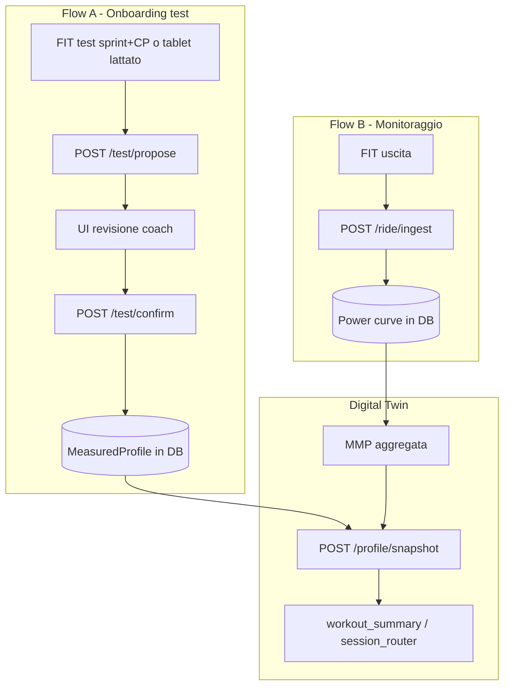

# Guida per lo sviluppatore frontend — Digital Twin Backend

Documento per uno **sviluppatore software** che deve costruire il frontend collegato a questo backend, **senza background nel ciclismo endurance**. Spiega cosa produce il backend, come interpretare le metriche, come disegnarle e come progettare la **pagina Digital Twin** con i motori predittivi.

**Riferimenti nel repo**

| Risorsa | Path |
|---------|------|
| API HTTP | `api_app.py` |
| Facade Python | `engines/__init__.py` |
| Report per attività | `engines/io/workout_summary.py` |
| Config grafici | `engines/io/chart_builder.py`, `engines/io/activity_charts.py` |
| Contratto test tablet | `CONTRATTO_JSON_test.md` |
| Tier / confidenza | `engines/core/tiers.py`, `engines/core/metric_contracts.py` |
| Frontend MVP esistente | `frontend/` (oggi legge CSV; va migrato alle API) |

---

## 1. Idea di prodotto in una frase

Il backend trasforma **file FIT** (uscite dal ciclocomputer), **test in presenza** (sprint, CP 3/6/12 min, lattato) e **dati fisici dell’atleta** in un **profilo fisiologico personalizzato** e in **analisi per ogni allenamento**.

Non è un “Garmin clone”: molti numeri sono **stime modellate**, non misure dirette. Il backend è **onesto** quando mancano dati o la confidenza è bassa (`status: skipped`, campi `null`, `warnings`, `tier`).

---

## 2. Glossario minimo (per chi non fa ciclismo)

| Termine | Cosa significa | Unità tipica |
|---------|----------------|--------------|
| **Potenza (W)** | Quanto “forte” pedala il ciclista | Watt |
| **FTP** | Potenza sostenibile ~1 h (soglia funzionale) | W |
| **MLSS / CP** | Potenza alla soglia del lattato (max sostenibile a lungo) | W |
| **VO₂max** | Capacità aerobica massima | ml/kg/min |
| **VLamax** | Capacità anaerobica glicolitica | mmol/L/s |
| **MMP** | Miglior potenza media per ogni durata (curva potenza-durata) | `{secondi: W}` |
| **NP** | Normalized Power — intensità “equivalente” su terreno variabile | W |
| **IF** | Intensity Factor = NP / FTP | 0–1+ |
| **TSS** | Training Stress Score — carico dell’uscita | punti |
| **Durability** | Capacità di mantenere la performance nel tempo (affaticamento) | % o curva CP |
| **W′** | “Batteria” anaerobica sopra CP | Joule |
| **DFA-α₁** | Indice HRV legato a zona aerobica/anaerobica | 0–1 |
| **Fenotipo** | Profilo rider (diesel / all-rounder / sprinter) | etichetta |

**Regola d’oro per la UI:** distingui sempre **misura diretta** (potenza, FC dal FIT) da **modello** (VO₂max da MMP, MLSS da Mader).

---

## 3. Filosofia dati: tier e confidenza

Ogni output importante porta (o può portare):

```json
{
  "status": "success | error | skipped | insufficient_data | unavailable",
  "tier": "REFERENCE | MODEL | HEURISTIC | EXPERIMENTAL",
  "api_contract": { "module": "...", "method": "...", "confidence": 0.72 },
  "uncertainty": { "confidence_score": 0.72, "confidence_level": "moderate" },
  "limitations": ["testo libero..."]
}
```

| Tier | Significato UI | Come mostrarlo |
|------|----------------|----------------|
| **REFERENCE** | Formula standard su dati FIT (NP, TSS, zone) | Numero pieno, badge verde “Misurato / standard” |
| **MODEL** | Modello fisiologico (Mader, W′, mader_durability) | Numero + badge blu “Modello” + tooltip limitazioni |
| **HEURISTIC** | Soglie indicative (ACWR, durability empirica) | Numero + badge ambra “Indicativo” |
| **EXPERIMENTAL** | Esplorativo | Nascosto o sezione “Labs” |

**Se `status !== "success"` o un campo è `null`:** non inventare un valore. Mostra messaggio dal backend (`reason`, `message`, `warnings`).

---

## 4. Architettura frontend ↔ backend



Il backend è **stateless**: curve, anchor e snapshot vanno **persistiti** dal frontend/Supabase e rimandati alle API successive.

---

## 5. API HTTP (`api_app.py`)

Base URL esempio: `http://localhost:8000` (`make run`).

| Metodo | Path | Scopo |
|--------|------|--------|
| GET | `/health` | Health check |
| POST | `/test/propose` | N file FIT → proposta profilo (non committa) |
| POST | `/test/confirm` | Proposta confermata → anchor misurato |
| POST | `/ride/ingest` | 1 FIT → aggiorna curva potenza |
| POST | `/ride/update-profile` | MMP uscita + anchor → profilo aggiornato |
| POST | `/profile/snapshot` | MMP → snapshot metabolico completo |
| POST | `/ride/summary` | FIT o `power_json` → `workout_summary` completo |
| POST | `/ride/durability` | FIT + snapshot → CP residua + potenze sostenibili |
| POST | `/test/in-person` | Envelope tablet → test_protocols / lattato |

### 5.1 Flow A — Creazione profilo (test)

1. Coach carica 1+ FIT (sprint + CP3/6/12 idealmente).
2. `POST /test/propose` (multipart `files[]`) → `ProfileProposal`.
3. UI di **revisione**: mostra sprint scelto, blocchi CP, confidence, file sorgente.
4. Coach conferma → `POST /test/confirm` con body:

```json
{
  "proposal": { "...ProfileProposal.to_dict()..." },
  "athlete": { "weight_kg": 72, "gender": "MALE", "training_years": 10, "discipline": "ENDURANCE" },
  "measured_on": "2026-06-01"
}
```

5. Salvare in DB `anchor` (`vo2max`, `mlss_watts`, `vlamax`, `measured_on`, `source`).

**Test tablet (lattato):** usare `CONTRATTO_JSON_test.md` + `run_in_person_test` / `engines.performance.test_protocols` (integrazione parallela all’API FIT).

### 5.2 Flow B — Monitoraggio uscite

1. `POST /ride/ingest` — form: `file`, `ride_date`, `weight_kg`, `stored_curve_json` (opzionale).
2. Risposta: `curve` (persistere), `mmp_for_profiler`, `profile_should_refresh`.
3. Se refresh: `POST /ride/update-profile` con `anchor`, `ride_mmp`, `athlete`, `as_of`.

### 5.3 Read model — Dashboard metabolica

`POST /profile/snapshot`:

```json
{
  "mmp": { "60": 420, "300": 340, "1200": 285, "3600": 255 },
  "athlete": { "weight_kg": 72, "gender": "MALE", "training_years": 10, "discipline": "ENDURANCE" }
}
```

Risposta = `generate_metabolic_snapshot()` (vedi §6).

---

## 6. Snapshot metabolico — cuore del Digital Twin

Campi principali da mostrare nella pagina profilo:

| Campo | Descrizione | UI |
|-------|-------------|-----|
| `estimated_vo2max` | VO₂max stimato | KPI grande + unità ml/kg/min |
| `estimated_vlamax_mmol_L_s` | VLamax | KPI + scala fenotipo |
| `mlss_power_watts` / `mlss_power_wkg` | Soglia lattato | KPI W e W/kg |
| `fatmax_power_watts` | Massima ossidazione grassi | KPI |
| `map_aerobic_watts` | MAP aerobica | KPI secondario |
| `metabolic_phenotype` | Diesel / sprinter / … | Badge + icona |
| `confidence_score` | Affidabilità globale | Gauge 0–100% |
| `combustion_curve` | Grassi vs carboidrati vs potenza | Area chart stacked |
| `zones` | Zone da profilo | Barre o tabella |
| `cross_validation` | Coerenza modello vs potenza osservata | Semáforo + testo |
| `unmasked_estimates` | Valori “debug” se campo mascherato | Solo modal tecnico |
| `expressiveness` | Quali durate MMP mancano | Checklist ancore |

**Mascheramento:** se MMP non copre durate soglia, `mlss_power_watts` può essere `null` ma `unmasked_estimates` ha il valore grezzo. La UI **non** deve mostrare il valore mascherato come certo.

**Cross-validation (`cross_validation`):**

| `severity` | UI |
|------------|-----|
| `none` | Verde — profilo coerente |
| `mild` / `moderate` | Giallo — warning + `recommended_action` |
| `severe` | Rosso — “Non affidabile, ripetere test” |

---

## 7. Report singola attività — `build_workout_summary`

Chiamata Python (da wrappare in endpoint es. `POST /ride/summary`):

```python
from engines import build_workout_summary
summary = build_workout_summary(stream, weight_kg=72, ftp=280, metabolic_snapshot=snap)
```

### 7.1 Struttura risposta

```json
{
  "status": "success",
  "schema_version": "1.0.0",
  "stream_metadata": { "duration_s", "has_power", "has_hr", "has_rr", ... },
  "sections": {
    "power": { ... },
    "zones": { ... },
    "classification": { ... },
    "hrv": { ... },
    "cardiac": { ... },
    "mader_durability": { ... }
  },
  "headline": { ... },
  "warnings": [ "..." ],
  "section_contracts": { ... }
}
```

### 7.2 Sezioni e grafici consigliati

| Sezione | Contenuto | Visualizzazione |
|---------|-----------|-----------------|
| **power** | NP, IF, TSS, VI, MMP, CP+W′ fit | KPI row + `chart_power_duration_curve` |
| **zones** | Coggan 7 zone, Friel HR, Seiler 3 zone | Donut / barre stacked `chart_zones_distribution` |
| **classification** | Fenotipo Coggan da MMP | `chart_phenotype_spider` |
| **hrv** | Timeline DFA-α₁ (se RR) | `chart_hrv_timeline` |
| **cardiac** | Drift, decoupling, recovery, kinetics | `chart_cardiac_drift`, `chart_hr_recovery`, `chart_power_hr_scatter` |
| **mader_durability** | CP residua ODE + potenze sostenibili | Vedi §7.3 |

**Headline** (card in cima alla pagina attività): `tss`, `normalized_power`, `intensity_factor`, `worst_cardiac_drift_pct`, `rider_phenotype`, `mader_durability_loss_pct`, `mader_sustainable_3h_w`.

### 7.3 Mader durability (per uscita lunga)

Disponibile solo con `metabolic_snapshot` valido.

| Campo | Grafico |
|-------|---------|
| `cp_residual_curve` | Linea tempo: CP residua (W) vs secondi |
| `kj_above_cp_curve` | Asse X alternativo: kJ sopra soglia |
| `cp_residual_at_kj` | Linea o tabella: kJ → CP residua |
| `durability_loss_pct` | KPI % perdita CP (nadir sessione) |
| `sustainability.sustainable_steady_power_w` | Tabella: potenza max costante per 1h–5h a 5/10/15% perdita CP |
| `sustainability.training_recommendations` | Testo coach |

**Layout suggerito:** grafico doppio asse (potenza dell’uscita in grigio + `cp_residual_curve` in arancio) + pannello laterale “Se hai fatto X kJ sopra soglia, la tua CP effettiva era Y W”.

### 7.4 Serie attività (`activity_charts.py`)

Per la pagina dettaglio uscita, costruire grafici time-series da `ActivityStreamEnhanced`:

- elevazione, velocità, potenza, FC, cadenza
- temperatura, bilanciamento L/R (se presenti nel FIT)
- time-in-zone sovrapposto

Ogni builder ritorna `{ "available": true/false, "reason": "..." }` — **nascondere** il chart se `available: false`.

---

## 8. Catalogo motori — cosa fa il backend e come rappresentarlo

### 8.1 Per attività (dopo ogni FIT)

| Modulo | Output chiave | Grafico / UI |
|--------|---------------|--------------|
| `fit_parser` | Stream campionato | — (interno) |
| `power_engine` | NP, IF, TSS, MMP | KPI + curva P-D |
| `zones_engine` | Tempo in zona | Donut multipli |
| `coggan_classifier` | Fenotipo | Spider / badge |
| `hrv_engine` | α₁ per finestra | Linea + bande 0.75 / 0.50 |
| `cardiac_engine` | Drift, decoupling | Linee segmenti |
| `durability_engine` | DI % prima/ultima ora | KPI + confronto barre |
| `mader_durability` | CP residua meccanicistica | Curve §7.3 |
| `w_prime_balance_engine` | W′ bilancio | Area sotto CP |
| `interval_detector` | Categoria sessione | Chip TEST/HIIT/FREE |
| `session_router` | Motori eseguiti | Timeline pipeline (debug) |
| `explainability_engine` | Narrativa testuale | Box “Cosa significa” |

### 8.2 Longitudinale / profilo

| Modulo | Output chiave | Grafico / UI |
|--------|---------------|--------------|
| `metabolic_profiler` | Snapshot completo | Pagina Digital Twin |
| `cross_validation_engine` | Coerenza | Semáforo + matrix `chart_cross_validation_matrix` |
| `bayesian_profiler` | Posterior VO₂/VLa | Distribuzione + CI |
| `metabolic_kalman` | Traiettoria nel tempo | Linea con banda |
| `metabolic_current` | Stato attuale + detraining | KPI decay |
| `detraining_engine` | CTL/ATL/TSB | `chart_training_load` |
| `training_variability_engine` | ACWR, monotony | KPI + sparkline |
| `metabolic_flexibility_engine` | Indice flessibilità | Gauge |
| `race_prediction_engine` | Simulazione gara GPX | Profilo altimetrico + tempo |

### 8.3 Test in presenza (tablet)

Vedi `CONTRATTO_JSON_test.md`: Mader (lattato), incrementale, curva P-c, CP, Wingate.

UI tablet: wizard step-by-step; UI coach: esito validazione (`validated`, `verdict`, `severity`).

---

## 9. Pagina Digital Twin — specifica funzionale

### 9.1 Obiettivo

Una vista **per atleta** che risponde a:

1. Chi è fisiologicamente (VO₂max, VLamax, MLSS, fenotipo)?
2. Il profilo è **affidabile** (ancore + cross-validation)?
3. Come **evolve** nel tempo (Kalman, detraining)?
4. Cosa può **sostenere** in gara/allenamento (mader_durability, race sim)?
5. Cosa **manca** per migliorare la stima?

### 9.2 Layout consigliato (desktop)

```
┌─────────────────────────────────────────────────────────────────┐
│ HEADER: Nome atleta | peso | ultimo test | confidence globale   │
│ [Badge anchor: OK / parziale / mancante]                        │
├─────────────────────────────────────────────────────────────────┤
│ ROW KPI (4–6 card)                                              │
│  VO2max | VLamax | MLSS W | FatMax | Fenotipo | MLSS W/kg       │
├──────────────────────────┬──────────────────────────────────────┤
│ Curva potenza-durata     │ Combustione (fat vs CHO)             │
│ (MMP + fit Mader)        │ (stacked area)                       │
├──────────────────────────┴──────────────────────────────────────┤
│ COERENZA PROFILO (cross_validation) + recommended_action        │
├──────────────────────────┬──────────────────────────────────────┤
│ Traiettoria Kalman       │ Carico CTL/ATL/TSB                   │
│ (VO2, VLa, MLSS nel      │                                      │
│  tempo)                  │                                      │
├──────────────────────────┴──────────────────────────────────────┤
│ DURABILITY PREDITTIVA (ultima uscita lunga selezionata)         │
│  CP residua vs kJ | tabella potenze sostenibili 3h/5h           │
├─────────────────────────────────────────────────────────────────┤
│ ANCORE MANCANTI (expressiveness / checklist)                    │
│  ☐ Sprint  ☐ CP3  ☐ CP6  ☐ CP12  ☐ Lattato                     │
└─────────────────────────────────────────────────────────────────┘
```

### 9.3 Stati della pagina

| Stato | Condizione | Cosa mostrare |
|-------|------------|---------------|
| **Empty** | Nessun FIT / nessun test | CTA “Carica test sprint+CP” |
| **Partial** | Anchor parziale o MMP povera | Profilo con campi `null` grigiati + lista ancore |
| **Ready** | Snapshot success + cross_validation ok | Tutti i pannelli predittivi attivi |
| **Stale** | Anchor vecchio (>90 gg) | Banner “Ricalibrare con test” |

### 9.4 Motor predittivi — come collegarli

| Domanda utente | Motore | Chiamata |
|----------------|--------|----------|
| Profilo attuale | `metabolic_profiler` | `/profile/snapshot` |
| Profilo dopo uscite | `profile_anchor_flow` | `/ride/update-profile` |
| Incertezza | `bayesian_profiler` | Python diretto (fase 2 API) |
| Trend nel tempo | `metabolic_kalman` | Storico `DailyInput` da FIT classificati |
| Decadimento forma | `metabolic_current` | Anchor + workout_history |
| Gara su percorso | `race_prediction_engine` | Upload GPX + profilo |
| Durata sostenibile | `mader_durability` | Snapshot + power stream ultima uscita lunga |
| Spiegazione testuale | `explainability_engine` | Su `workout_summary` |

**Ordine di caricamento consigliato (React):**

1. Caricare `anchor` + `stored_curve` da DB.
2. `POST /profile/snapshot` con `mmp_for_profiler` derivata dalla curva.
3. Parallelo: ultimi N `workout_summary` per uscite recenti.
4. Se esiste uscita >2h: `compute_session_durability` per pannello durability.
5. Se storico >30 giorni: Kalman + training load.

### 9.5 Cosa **non** fare

- Non mostrare VO₂max/MLSS come “verità di laboratorio” senza test lattato.
- Non nascondere `warnings` e `cross_validation.severity`.
- Non usare DFA-α₁ da uscita libera per estrarre soglie (solo da ramp test — `session_router` già lo limita).
- Non chiamare `generate_metabolic_snapshot` senza MMP con almeno 3 durate diverse.

---

## 10. `chart_builder` — integrazione pratica

Il backend non renderizza grafici: restituisce **config JSON** compatibili con Recharts / Chart.js / Plotly.

```python
from engines.io.chart_builder import (
    chart_power_duration_curve,
    chart_metabolic_combustion,
    chart_training_load,
    chart_cross_validation_matrix,
)
```

Ogni config contiene: `type`, `data`, `config` (assi, colori), `metadata` (titolo, unità).

**Palette ufficiale** (da rispettare per coerenza): vedi `COLORS` in `chart_builder.py` (verde endurance, blu aerobico, rosso soglia).

**Frontend:** componente `<EngineChart config={payload} />` che fa switch su `config.type`.

---

## 11. Modello dati da persistere (Supabase / DB)

| Entità | Campi minimi | Note |
|--------|--------------|------|
| `athletes` | id, weight_kg, gender, training_years | |
| `measured_profile` | vo2max, mlss_watts, vlamax, measured_on, source | Da `/test/confirm` |
| `power_curve` | athlete_id, curve JSON, updated_at | Da `/ride/ingest` |
| `activities` | fit_url, date, summary JSON, headline JSON | `build_workout_summary` |
| `metabolic_snapshots` | athlete_id, snapshot JSON, mmp JSON, created_at | Storico per trend |
| `test_sessions` | envelope JSON, result JSON | Tablet `CONTRATTO_JSON_test` |

---

## 12. Roadmap UI consigliata

### Fase 1 — MVP (sostituire CSV in `frontend/`)

- [ ] Client API verso `api_app.py`
- [ ] Lista atleti + dettaglio attività
- [ ] Pagina Digital Twin (snapshot + KPI + combustion + cross_validation)
- [ ] Upload FIT test → propose → confirm
- [ ] Upload FIT uscita → ingest

### Fase 2 — Predittivo

- [ ] mader_durability su uscite lunghe
- [ ] Kalman trend + training load charts
- [ ] Race simulation GPX
- [ ] Tablet test (Mader lattato) via `run_in_person_test`

### Fase 3 — Coach pro

- [ ] Confronto atleti
- [ ] Narrative `explainability_engine`
- [ ] Notifiche anchor scaduto / profilo incoerente

---

## 13. Endpoint attività e test (già in `api_app.py`)

| Endpoint | Body | Motore |
|----------|------|--------|
| `POST /ride/summary` | `multipart`: `file` **oppure** `power_json`, `weight_kg`, opz. `ftp`, `metabolic_snapshot_json` | `build_workout_summary` |
| `POST /ride/durability` | `multipart`: `file` **oppure** `power_json`, `weight_kg`, `metabolic_snapshot_json` (obbligatorio) | `compute_session_durability` |
| `POST /test/in-person` | JSON envelope (`CONTRATTO_JSON_test.md`) | `test_protocols` |

**Esempio summary senza FIT (test / demo):**

```bash
curl -X POST http://localhost:8000/ride/summary \
  -F 'weight_kg=72' \
  -F 'ftp=280' \
  -F 'power_json=[200,210,220,...]' \
  -F 'metabolic_snapshot_json={"status":"success",...}'
```

### Endpoint ancora da aggiungere (fase 2)

| Endpoint proposto | Motore |
|-------------------|--------|
| `POST /profile/kalman` | `process_workout_history` |
| `POST /race/simulate` | `simulate_gpx_race` |

---

## 14. Esempio flusso completo (sequenza)

```
1. Coach carica FIT test (sprint + CP)     → POST /test/propose
2. UI mostra proposal, coach conferma      → POST /test/confirm → salva anchor
3. Sistema calcola snapshot iniziale       → POST /profile/snapshot → salva
4. Atleta pedala, FIT uscita               → POST /ride/ingest → aggiorna curve
5. Se profile_should_refresh              → POST /ride/update-profile
6. UI attività                            → build_workout_summary (BFF)
7. Pagina Digital Twin                    → snapshot + kalman + durability
```

---

## 15. Contatti codice — import Python utili

```python
from engines import (
    build_workout_summary,
    MetabolicProfiler,
    compute_session_durability,
    get_current_metabolic_status,
    tier_for,
)
from engines.io.session_router import route_and_run
from engines.io.chart_builder import chart_power_duration_curve, chart_metabolic_combustion
```

---

*Documento generato per Backend-definitivo-V5. Aggiornare quando si aggiungono endpoint in `api_app.py` o nuovi motori in `engines/`.*
