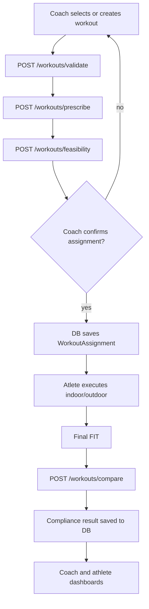

# Workout System Backend V1

This V1 turns DDTraining from a FIT analyser into a prescription-to-execution system.

## Backend responsibilities

The backend owns all domain decisions:

- workout template validation
- athlete-specific workout prescription
- CP/W′ feasibility before assignment
- calendar assignment state rules
- comparison between assigned workout and performed FIT
- compliance score, confidence score and discrepancy detection

The frontend owns interaction and display:

- workout editor
- calendar UI and drag/drop
- upload/sync controls
- coach/athlete visual reports

## Main flow



## New endpoints

### `POST /workouts/validate`

Validates that a coach draft or library template is machine-readable.

Input:

```json
{
  "workout": {
    "title": "2x3 VO2",
    "steps": [
      {"step_id": "warmup", "duration_s": 600, "target_pct_ftp": 55},
      {"step_id": "i1", "type": "work", "duration_s": 180, "target_pct_cp": 120, "is_key_step": true}
    ]
  }
}
```

Output includes status, normalized workout, duration and warnings.

### `POST /workouts/prescribe`

Resolves template targets into athlete-specific targets. For example, 120% CP becomes concrete Watts using the athlete profile.

Input:

```json
{
  "workout": {...},
  "athlete_profile": {"cp_w": 280, "ftp_w": 270, "weight_kg": 70}
}
```

### `POST /workouts/feasibility`

Pre-assignment feasibility check. It simulates W′ balance through the planned workout.

Returns:

- `feasibility_score`
- `confidence_score`
- `classification`
- `min_w_prime_balance_pct`
- step-by-step W′ analysis
- coach recommendations

### `POST /workouts/compare`

Compares the assigned workout against an uploaded FIT or `power_json`.

Multipart fields:

- `workout_json` required
- `athlete_profile_json` optional
- `tolerance_policy_json` optional
- `file` optional FIT upload
- `power_json` optional 1 Hz power array

Returns:

- `compliance_score`
- `confidence_score`
- `classification`
- `validity`
- matched intervals
- discrepancies

### `POST /workouts/calendar/transition`

Validates assignment status transitions so all clients follow the same calendar workflow.

## Engine layout

```text
engines/workouts/
├── models.py              # workout schema normalization and validation
├── template_engine.py     # template validation and athlete-specific prescription
├── feasibility_engine.py  # CP/W′ pre-assignment simulation
├── compliance_engine.py   # assigned-vs-performed comparison
└── calendar_engine.py     # assignment status transition rules
```

## V1 assumptions

- Compliance V1 uses sequential alignment from activity start.
- This is reliable for indoor workouts and basic outdoor sessions.
- Future V2 should add dynamic interval matching for outdoor files with pauses, traffic, stops or shifted starts.
- Feasibility V1 uses CP/W′ and a conservative W′ recovery model.
- Fatigue state and metabolic snapshot can be layered on top in V2.

## Recommended DB objects

- `workout_templates`
- `workout_template_versions`
- `workout_prescriptions`
- `workout_assignments`
- `workout_executions`
- `workout_compliance_results`

The backend V1 is stateless and DB-ready: API clients can persist returned prescriptions, feasibility reports and compliance results.
